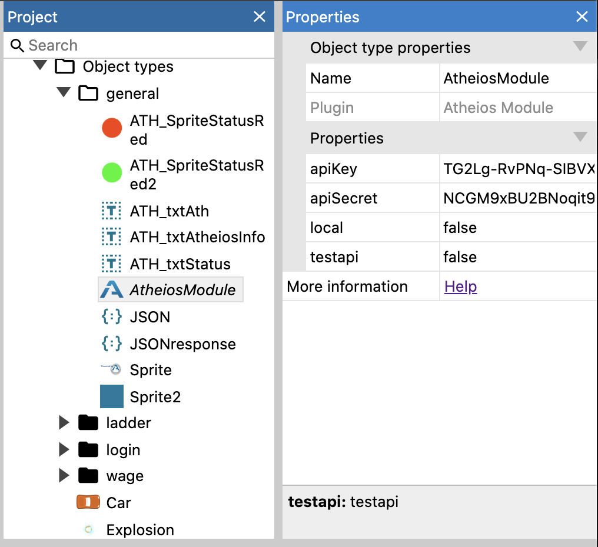

# Construct
Construct is a programmable game engine for HTML5 games and a good entry level into 
gaming. The Atheios team has developed a construct 3 module which can be embedded
into your game project. It provides a possibility to send and receive data via a websocket.

The module can be found here:

https://www.construct.net/en/make-games/addons/321/atheios-blockchain-module

On the same page you can also find some example code to show how to communicate with the module.

In order for the code to work you need to register as a game developer at:
https://portal.atheios.org
After game creation on the portal, you will get a game token an game secret, which you need to use to initialize the Atheios module in construct.

## Configuration
This is the view when clicking on the Atheios module to show the module properties.
There are four properties to schedule:

* apiKey (An alphanumerical string)
* apiSecret (An alphanumerical string)
* local (boolean)
* testapi (boolean)

The first two will be copied from the portal at game registration.
Set local and testapi to false as in the picture.

Setting testapi to true would instead call the testapi, which typically contains the next 
test version of the GARP api.

  

