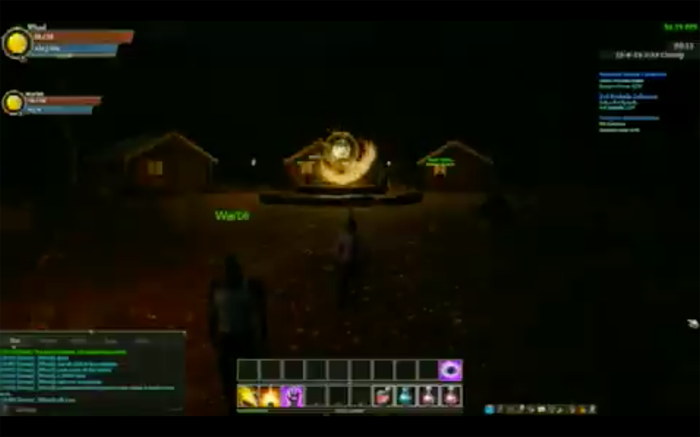

# Introduction to Atheios

  

Atheios is a blockchain for gaming. Beside the blockchain we are providing a framework which is interfacing the blockchain.

The framework for game developers and gamers alike.
This documentation describes how You can access the Atheios ecosystem as a gamer, app developer, game developer and so forth.

Note that all our work is transparent and can be found on [Github](https://github.com/atheiosofficial/).

## About Atheios

## Some history
Atheios has an interesting history with some drama. Originally Atheios was founded by
a developer called Berran in May 2018. His background has been in the gaming software 
industry.  
He created Atheios as a branch from the Gubiq blockchain and started off with DigDeep
to start a discord channel and other collaterals.
LegacyTRX joint the team with others around summer in order to broaden the chains activities.
One item Berran felt very passionated about was to develop an own game. With his 
experience in the graphics industry he pulled off a game demo called "Atherlore".

  

Then suddently a short message from Berran to the core team: "The shit has hot the fan." and he left.

It is amazing to see that immediately after this sad event the Atheios community 
grouped together to discuss how to move forward and came out with a statement: 

> We are currently assessing and discussing different options, but one thing is 
> clear: we, as a strong community, are committed to making the next “Atheios” 
> broader and stronger. Existing network strength, security and health will 
> remain a primary focus as we overcome this challenge.

That was the start of Atheios 2.0 and that story will evolve. 
